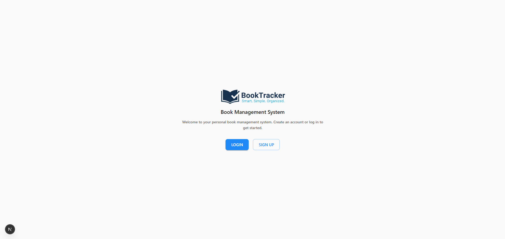
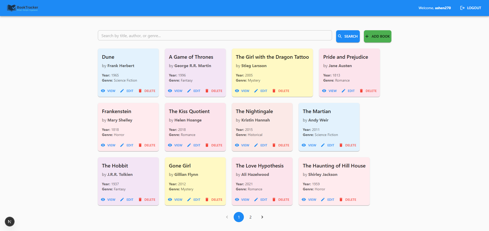

# 📖 BookTracker

> A web-based platform for managing your favorite books

---

## 📸 Screenshot

---

## 🚀 Tech Stack

- [Next.js 16](https://nextjs.org/) – React framework with App Router  
- [React 19](https://reactjs.org/) – Latest React with modern features  
- [TypeScript](https://www.typescriptlang.org/) – Type-safe development  
- [MaterialUI](https://mui.com/) – Open-source React component library
- [ExpressJS](https://expressjs.com/) – Node.js web application framework
- [GraphQL](https://graphql.org/) – GraphQL is an open-source query language for Application Programming Interfaces (API)

## 🛠️ Getting Started

### Prerequisites

Node.js 18+
npm or yarn or pnpm

### Installation

Clone the repository
git clone https://github.com/Ashen270/booktracker.git
cd booktracker/client
Install dependencies

npm install
# or
yarn install
# or
pnpm install

### Start the development server

npm run dev
# or
yarn dev
# or
pnpm dev

